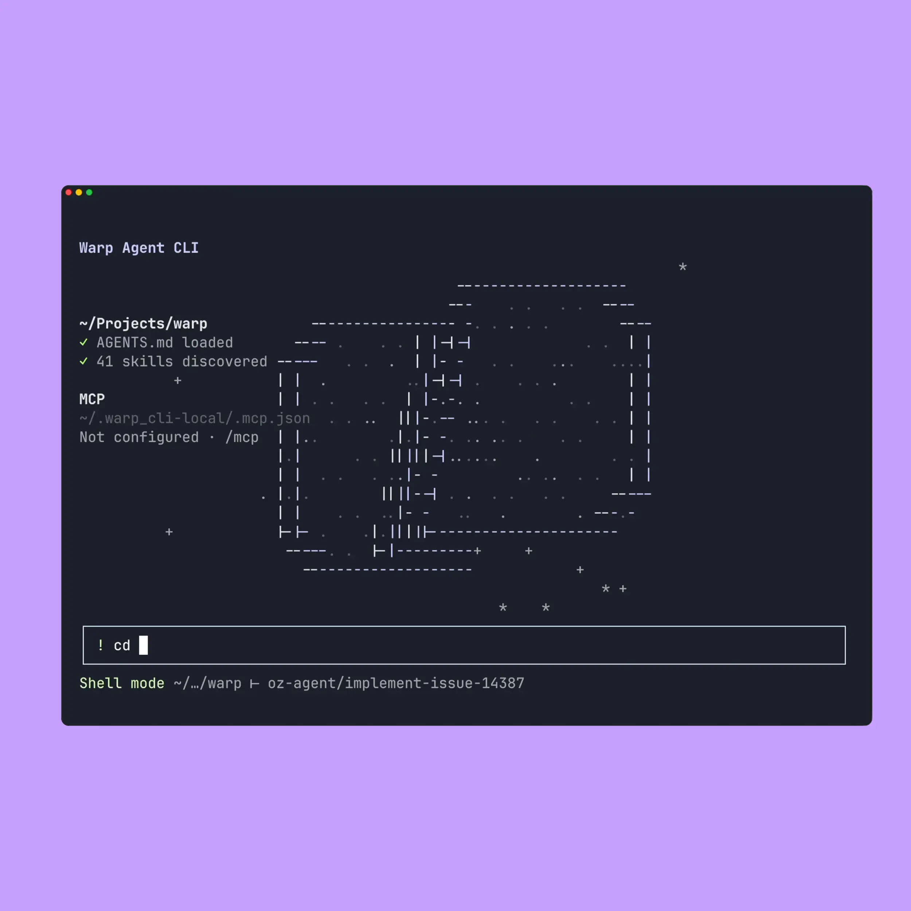

# Warp Agent CLI for Termux


Unofficial installer. Runs Warp Agent CLI on ARM64 Android via Termux + Ubuntu PRoot. Also installs [Tailcat](https://github.com/tailscale/tailcat) and a Termux:API bridge.

Use Termux from [F-Droid](https://f-droid.org/packages/com.termux/) or [GitHub](https://github.com/termux/termux-app/releases), not Play Store.

<p align="center">
  
</p>

## Install

```bash
curl -sL https://raw.githubusercontent.com/DSamuelHodge/warp-agent-cli/main/setup.sh | bash
```

Safe to re-run. Already-installed Termux:API CLI, Tailcat, and Warp are skipped. The Termux:API **app** still has to come from F-Droid or GitHub.

## Start

```bash
warp-agent
```

```bash
proot-distro login ubuntu --bind "$HOME/.warp-termu1x-api:/bridge"
```

`warp-agent` is already on PATH. No alias needed.

## Tailcat

Binary lives in Ubuntu. Termux `tailcat` wraps it. Listener is not started for you.

```bash
termux-wake-lock
tailcat serve --key=default 8022
```

```bash
tailcat ssh tcXXXXXXXXX
tailcat ping tcXXXXXXXXX
```

Share the `tc…` address out of band. Keep `serve` in its own Termux session — it dies with `warp-agent`.

## Termux:API

Install the **Termux:API app** from F-Droid or GitHub. `warp-agent` starts the host bridge.

```bash
termux-api battery-status
termux-api toast -- "build finished"
termux-clipboard-get
termux-tts-speak "hello"
termux-vibrate
termux-location
```

Grant app permissions. Bridge allowlists `termux-*` only.

## SSH

Port **8022**, not 22.

```bash
pkg install -y openssh
passwd
whoami
sshd
ip -4 addr show wlan0
termux-wake-lock
```

```bash
ssh -p 8022 u0_aXXX@PHONE_LAN_IP
warp-agent
```

```bash
sftp -P 8022 u0_aXXX@PHONE_LAN_IP
```

Off-LAN: Tailcat, Tailscale, or ZeroTier. Do not forward port 22.

## Update

```bash
proot-distro login ubuntu -- bash -c "apt-get update && apt-get install --only-upgrade warp"
```

Re-run the installer to refresh wrappers, Tailcat, and the API bridge.

## License

MIT. See [LICENSE](LICENSE).
